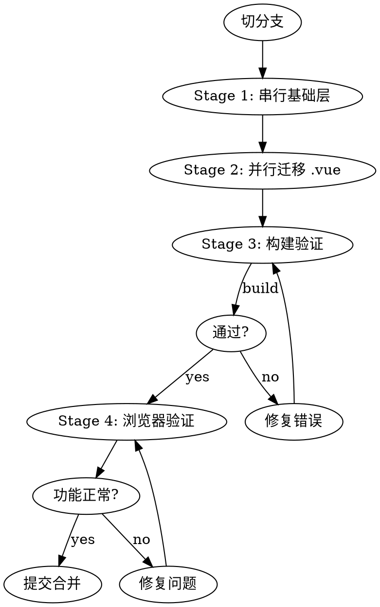

# Vue 2 → Vue 3 微前端子应用迁移

## Overview

在 Qiankun 微前端架构下，将子应用从 Vue 2 + ElementUI + Vuex 迁移到 Vue 3 + Element Plus + Pinia + TypeScript。保持原有构建工具（Vue CLI），不切换 Vite。

## 迁移流程



## Stage 1: 串行基础层（主 Agent 完成）

按顺序执行，后续 Stage 2 的所有 Agent 都依赖这些文件：

### 1.1 升级 package.json 依赖

```
升级：
  vue 2.6 → 3.4
  vue-router 3 → 4
  element-ui → element-plus + @element-plus/icons-vue
  vuex → pinia
  echarts 4 → 5（如有）
  moment → dayjs（如有）

新增：
  @vue/cli-service 5.x（支持 Vue 3）
  vue-loader（如需升级到支持 Vue 3 的版本）

移除：
  @vue/composition-api（Vue 3 内置）
  vue-template-compiler（Vue 3 不需要）
  core-js（如不需要）
```

### 1.2 迁移 main.ts（入口 + Qiankun lifecycle）

```typescript
// 关键改动：
// 1. new Vue() → createApp()
// 2. Vue.use() → app.use()
// 3. 添加 Qiankun lifecycle（如原来没有）

import { createApp } from 'vue'
import { createPinia } from 'pinia'
import ElementPlus from 'element-plus'
import 'element-plus/dist/index.css'
import App from './App.vue'
import router from './router'

let app = null

function render(props = {}) {
  const container = props.container
  app = createApp(App)
  app.use(createPinia())
  app.use(router)
  app.use(ElementPlus, { size: 'small' })
  const mountEl = container
    ? container.querySelector('#app')
    : document.querySelector('#app')
  app.mount(mountEl)
}

export async function bootstrap() {}
export async function mount(props) { render(props) }
export async function unmount() { app?.unmount(); app = null }

if (!window.__POWERED_BY_QIANKUN__) { render() }
```

### 1.3 Vuex → Pinia

```typescript
// 旧：Vuex
new Vuex.Store({
  state: { foo: null },
  mutations: { SET_FOO(state, val) { state.foo = val } },
  actions: { async getFoo({ commit }) { commit('SET_FOO', data) } },
  getters: { foo: state => state.foo }
})

// 新：Pinia
export const useFooStore = defineStore('foo', () => {
  const foo = ref(null)
  async function getFoo() { foo.value = data }
  return { foo, getFoo }
})

// 组件中：
// context.root.$store.getters.foo → const store = useFooStore(); store.foo
```

### 1.4 vue-router 3 → 4

```typescript
// 旧：
Vue.use(VueRouter)
new VueRouter({ mode: 'history', base: process.env.BASE_URL, routes })

// 新：
import { createRouter, createWebHistory } from 'vue-router'
createRouter({ history: createWebHistory(process.env.BASE_URL), routes })

// 组件中：
// context.root.$router → const router = useRouter()
// context.root.$route → const route = useRoute()
```

### 1.5 utils / services → TS 化

```
关键替换：
  import { Notification } from 'element-ui'  → import { ElNotification } from 'element-plus'
  import { MessageBox } from 'element-ui'    → import { ElMessageBox } from 'element-plus'
```

### 1.6 filters → 纯函数

Vue 3 移除了 filters，改为 import 普通函数调用。

### 1.7 处理自研包

```
自研包不可升级时的策略：
  cmp-echarts → 改为引用本地子目录组件，跳过封装层
  cmp-element → 用 Element Plus 原生组件逐处替换
  其他包 → 先验证 Vue 3 兼容性，不兼容则写 wrapper
```

## Stage 2: 并行迁移 .vue 文件（子 Agent）

按目录拆分给多个子 Agent，每个 Agent 只改指定目录。

### .vue 文件改写规则

```
1. <script> → <script setup lang="ts">
2. export default { data, computed, methods, watch } → ref/reactive/computed/watch/函数
3. this.xxx → 直接引用
4. this.$refs.xxx → const xxx = ref<T>()
5. this.$emit → defineEmits
6. props → defineProps<{}>()
7. this.$router → useRouter()
8. this.$store → usePiniaStore()
9. mixins → Composables (useXxx)
10. @vue/composition-api 导入 → 从 'vue' 导入
11. context.root.$router → useRouter()
12. context.root.$store → usePiniaStore()
13. context.emit() → defineEmits
```

### Element Plus 替换规则

```
:visible.sync="show"              → v-model="show"
@click.native                     → @click
this.$message()                   → import { ElMessage } from 'element-plus'; ElMessage()
this.$confirm()                   → ElMessageBox.confirm()
this.$loading()                   → ElLoading.service()
<i class="el-icon-edit">          → <Edit /> (from @element-plus/icons-vue)
<template slot="xxx">             → <template #xxx>
el-radio-button label=            → el-radio-button value=
```

## Stage 3: Lint + 代码质量审查（提交前必须通过）

### 3.1 Lint 检查（硬性门禁）

```bash
# 必须 0 errors 才能进入下一步
npx eslint src/ --ext .ts,.vue
npx vue-cli-service lint --no-fix

# 自动修复可修复的问题
npx eslint src/ --ext .ts,.vue --fix
```

**lint 不通过 → 不允许提交。**

### 3.2 代码质量审查（/simplify）

迁移完成后、提交前，运行 `/simplify` 审查：

```
检查项：
- 重复代码（>10 行相似 → 抽取共享函数或 composable）
- 过大组件（>300 行 → 拆分）
- 未使用的导入和变量（删除）
- any 类型残留（补充具体类型）
- 空 catch 块（添加错误处理）
- 可复用逻辑（抽取 useXxx）
```

## Stage 4: 构建验证

```bash
vue-cli-service build  # 或项目原有的构建命令
```

## Stage 5: 浏览器验证

**迁移完成 = 浏览器中所有功能正常运行，不是编译通过。**

启动 dev server，在浏览器中逐页验证。发现问题修复后重新验证，直到全部正常。

## 提交前完整流程

```
迁移 .vue 文件完成
  ↓
① eslint 0 errors
  ↓
② /simplify 代码质量审查通过
  ↓
③ vue-cli-service build 通过
  ↓
④ 浏览器功能验证通过
  ↓
⑤ git commit
```

**跳过任何一步都不允许提交。**

---

## 踩坑速查表

| 问题 | 症状 | 修复 |
|------|------|------|
| ECharts v5 import | `echarts.init is not a function` | `import * as echarts from 'echarts'` |
| ECharts data 空值 | `Cannot read properties of undefined (reading 'forEach')` | updateChart 开头加 `if (!props.data) return` |
| vue-seamless-scroll | `Cannot read properties of undefined (reading '_c')` | 替换为 `vue3-seamless-scroll`，组件名和属性名都变 |
| @jiaminghi/data-view | `Failed to resolve component: dv-decoration-9` | 替换为 `@kjgl77/datav-vue3`，组件名兼容 |
| CSS `~assets/` | 背景图不显示 | `url('~assets/...')` → `url('@/assets/...')`（Vite 场景）|
| cmp-echarts 不可用 | `Cannot resolve module 'cmp-echarts'` | 改为引用本地子目录组件 |
| mixins 无法使用 | `mixins option is deprecated` | 转为 composable（useXxx） |
| process.env 未定义 | `ReferenceError: process is not defined` | Vite: `import.meta.env.VITE_*`；Vue CLI: 保持 `process.env` |

## 第三方库替换表

| Vue 2 包 | Vue 3 替代 |
|---------|-----------|
| @vue/composition-api | vue（内置） |
| element-ui | element-plus |
| vuex | pinia |
| vue-router@3 | vue-router@4 |
| echarts@4 | echarts@5 |
| moment | dayjs |
| vue-seamless-scroll | vue3-seamless-scroll |
| @jiaminghi/data-view | @kjgl77/datav-vue3 |
| vue-template-compiler | 移除 |
| vue-class-component | 改写为 `<script setup>` |
| vue-property-decorator | defineProps / defineEmits |

## Agent 并行拆分原则

```
1. layouts/ + common/components/ 归一个 Agent，先行启动（是其他 Agent 的依赖）
2. views/ 按业务模块拆分，每路 100-150 个 .vue
3. 每个 Agent 只改指定目录，禁止跨目录修改
4. 共享同一份 CLAUDE.md 约束
5. 用 git worktree 隔离（如需并行写文件）
```

## 注意事项

- **保持原有构建工具**：不要把 Vue CLI 换成 Vite，升级 @vue/cli-service 到 v5 即可
- **自研包不动源码**：所有适配在应用侧完成
- **迁移完成标准**：浏览器逐页验证功能正常，编译通过只是前置门槛
- **踩坑即记录**：每个子应用迁完后在 docs/history/migration-notes/ 生成总结
